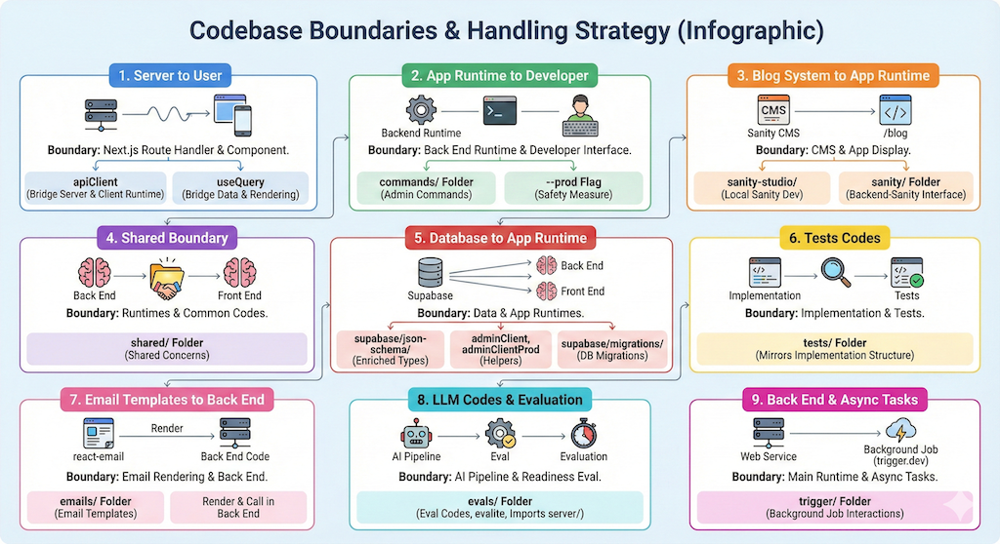

Understand the boundary and handle it. Think of boundary as a place/point where different parts of the system interact. Understanding the different boundaries make it easy to reason the flow of the app.

Example of boundaries:

1. Server to user: the boundary is the next.js route handler and the component that calls the route.
  **How we handle it:**
    - we have `apiClient` util to bridge the gap between server and client runtime
    - we use `useQuery` (which wraps the apiClient) to bridge the gap between data at client and how it's rendered in component
2. App runtime to app maintainer (developers): the boundary is the back end runtime and the developer's interface.
  **How we handle it:**
    - we have `commands` folder which store administration related commands which can be run locally and targets production environment
    - for safety, the commands will only target the production environment when `--prod` flag is provided
3. Blog system to app runtime: the boundary is between the CMS we use for our blog and how we show it in our app (eg. /blog).
  **How we handle it:**
    - we have `sanity-studio/` folder where we store sanity runtime. when we want to run sanity locally (e.g. to update the blog schema), we run from this folder, which is linked in root package.json for convenient (eg. `bun sanity:dev`).
    - we have `sanity/` folder where we store codes that interfaces between next runtime (back end) and sanity platform
4. Shared boundary: the boundary between runtimes and its common codes. there are codes that can be used in back end and front end.
  **How we handle it:**
    - when the shared concerns are clear, are stored in `shared/` folder.
5. Database (Supabase) to app runtime: the boundary between data in database and in back end and front end.
  **How we handle it:**
    - we have `supabase/json-schema/` folder where we store the type codes (ie. using zod) to add more specific typing for supabase codes, enriching the default types from the auto-generated Supabase types
    - we have helper codes like `adminClient`, `adminClientProd` to bridge gap between back end and supabase
    - we store supabase migrations at `supabase/migrations/`
6. Tests codes: the boundary between implementation codes and its tests.
  **How we handle it:**
    - all tests are stored in `tests/` folder, grouped in sub folders that mirror its implementation. for example, `tests/emails/` contains test codes for emails, `tests/server/` contains test codes for server codes.
7. email templates to back end: the boundary between the email rendering codes (we use react-email) and the backend.
  **How we handle it:**
    - we have `emails/` folder which store codes to build the email templates
    - to send, the email can be rendered and called in the back end code
8. LLM codes with its evaluation mechanism: the boundary between the codes that requires AI pipeline to work with the codes that evaluate its readiness.
  **How we handle it:**
    - we have `evals/` folder which store the evaluation codes (using evalite). it imports the codes from `server/` (or other place) and run the eval tests.
9. Back end code to async tasks: the boundary between our back end system and the async tasks (background job) runner. It's applicable here because we separate the main runtime (web service) and the background job.
  **How we handle it:**
    - we have `trigger/` folder which store codes that interact with the background job runner, e.g. trigger.dev
